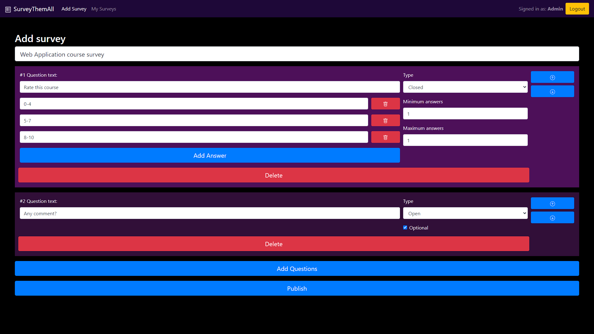

# Surveys WebApp
## Credits
Developers: Andrea Colli-Vignarelli
Date: 2021.06.29
## Description
Surveys WebApp is a very simple React based web application developed as a project for the coruse of "Applicazioni Web I" by Professor Enrico Masala in the Master Degree in Computer Engineering at Politecnico di Torino.

The projects is manly focused on the frontend application based on React technology, while the backend is a very simple REST-like web server based on Node.js.

The idea behind the project was to develop a web app where not logged users can compile any survey avaibled. Specific type of questions are avaible (open, closed with single choice or closed with multiple choice), it's just required to provide a name to associate to the answers given to the survey. Logged users can create surveys with a sort of editor and view all the answers they've recevied to their surveys.

Credentials to test the application can be found [here](#users-credentials).

Enjoy!

The Developer

-------------------------------------

# Technical specifications
### 2021.06.29: "Surveys-WebApp"
### Developers: COLLI-VIGNARELLI ANDREA 

## React Client Application Routes

- Route `/`: main page, view of all published surveys that can be compiled by anyone
- Route `/addSurvey`: page about survey creation, only logged admin can access
- Route `/login`: login page only if no admin is already logged
- Route `/compileSurvey`: page about survey compilation only after entered a name of the user who wants to compile. A survey ID is passed through Link state.
- Route `/mySurveys`: page only for logged admins. Here they can see all their created surveys and after selected one a state is passed to the same route with a specific Link component, then admins can see who compiled and how

## API Server

- POST `/api/login`

  Login into application, obtain session and admin data

  - sample request:

        curl --location --request GET 'http://localhost:3001/api/login' \
        --header 'Content-Type: application/json' \
        --data-raw '{
          "username": "admin@polito.it",
          "password": "password"
        }'

  - sample response:

        {"id": 1, "username":"admin@polito.it", "name":"Admin"}   (if loggedIn)
        {error	"Admin not authenticated" }   (if not logged)
- GET `/api/sessions/current`
  
  Get the current session or 401 HTTP status code if not already logged

  - sample request:

        curl --location --request POST 'http://localhost:3001/api/sessions/current'

  - sample response:

        {"id": 1, "username":"admin@polito.it", "name":"Admin"}   (if loggedIn)
        {error	"Admin not authenticated" }   (if not logged)

- DELETE `/api/sessions/current`
  
  Delete the current session and so log out the current user

  - sample request:

        curl --location --request DELETE 'http://localhost:3001/api/sessions/current'

  - sample response:

        {}

- GET `/api/opensurveys`
  
  Get all the open surveys avaible and their number of questions

  - sample request:

        curl --location --request GET 'http://localhost:3001/api/opensurveys'

  - sample response:

        [
          {"id":1,"title":"PC build survey","questions":10},
          {"id":3,"title":"Demon Slayer","questions":6},
          {"id":4,"title":"Web Application course survey","questions":2}
        ]
        
- GET `/api/mysurveys`
  
  With a logged admin, get all the surveys he owns with users who compiled it

  - sample request:

        curl --location --request GET 'http://localhost:3001/api/mysurveys'

  - sample response:

        [
          {"id":1,"title":"PC build survey","users":2},
          {"id":4,"title":"Web Application course survey","users":2}
        ]

- GET `/api/mysurveys/:id`
  
  With a logged admin, get question data and answers selected.

  - sample request:

        curl --location --request GET 'http://localhost:3001/api/mysurveys/4'

  - sample response:

        [
          {"qId":17,"qText":"Rate this course","qPriority":1,"qType":0,"aText":"8-10"},
          {"qId":18,"qText":"Any comment?","qPriority":2,"qType":1,"aText":"I learned a lot!"}
        ]
        
- POST `/api/opensurveys/:idSurvey/answers`
  
  Set the answers of a specific survey

  - sample request:

        curl --location --request POST '/api/opensurveys/4/answers' \
        --header 'Content-Type: application/json' \
        --data-raw {
          "user":"Happy student",
          "closedAnswers":[53],
          "openAnswers":[
              {"id":18,"text":"Nice course, but not excellent :|"}
            ]
          }

  - sample response:

        [
          {"qId":17,"qText":"Rate this course","qPriority":1,"qType":0,"aText":"8-10"},
          {"qId":18,"qText":"Any comment?","qPriority":2,"qType":1,"aText":"I learned a lot!"}
        ]

- GET `/api/mysurveys/4/users`
  
  With a logged admin, get all the users who compiled a specific survey.

  - sample request:

        curl --location --request GET 'http://localhost:3001api/mysurveys/4/users'

  - sample response:

        [
          {"id":4,"name":"Anonymous student"},
          {"id":7,"name":"Angry student"},
          {"id":8,"name":"Happy student"}
        ]
        
- GET `/api/mysurveys/:idSurvey/users/:idUser`
  
  With a logged admin, get all answers given by a specific user who compiled a specific survey.

  - sample request:

        curl --location --request GET 'http://localhost:3001/api/mysurveys/4/users/8'

  - sample response:

        [
          {"qId":17,"qText":"Rate this course","qPriority":1,"qType":0,"aText":"5-7"},
          {"qId":18,"qText":"Any comment?","qPriority":2,"qType":1,"aText":"Nice course, but not excellent :|"}
        ]

                
- POST `/api/mysurveys/`
  
  With a logged admin, create a new survey, passing it by body

  - sample request:

        curl --location --request POST '/api/opensurveys/4/answers' \
        --header 'Content-Type: application/json' \
        --data-raw {
          "title":"Example survey title",
          "questions":[
            {"text":"Question 1","priority":1,"min":0,"max":1,"type":0,"answers":["Yes","No"]},
            {"text":"Question open","priority":2,"min":0,"max":1,"type":1,"answers":[]},
            {"text":"Question 2","priority":3,"min":1,"max":2,"type":0,"answers":["Answer 1",
            "Answer 2","Answer 3"]}
          ]
        }

  - sample response:

        {}

## Database Tables

- Table `admins` - contains admins credentials and names
- Table `answers` - contains all the answers (closed and opened) generated by admins and users with relation to question
- Table `questions` - contains all the questions (closed and opened) generated by admins with relation to survey
- Table `surveys` - contains all the surveys generated by admins with relation to admin
- Table `users` - contains all the users who answered to a survey
- Table `usersanswers` - contains the relationships beetween users who answered and their own answers

## Main React Components

- `App` (in `App.js`): main component of the entire application. Wrap all the possible route, the different logIn/Out callbacks.
- `TopNavbar` (in `TopNavbar.js`): create a navbar with the brand link, a login/logout button to redirect to login page/logout the user, with at the end the eventually admin name.
- `OpenSurveys` (in `OpenSurveys.js`): a sort of wrapper component to create open surveys page with all the surveys cards that can be compiled.
- `SurveyCard` (in `OpenSurveys.js`): create a bootstrap card with a link to the same page, but with a state customized on specific survey ID.
- `LoginModule` (in `LoginModule.js`): create an entire login form with validation and call to previously passed callbacks.
- `MySurveys` (in `MySurveys.js`): a sort of wrapper component to create own surveys of the admin logged with all the surveys cards and their compilation rate.
- `MySurveysReport` (in `MySurveysReport.js`): a sort of wrapper component to create specific report about survey previously chosen. It's based on loop rendering of multiple QuestionForm based on the specific user selected by the component UserSelector.
- `QuestionForm` (in `MySurveysReport.js`): a component with the specific question text and the responses chosen by the user who compiled the survey.
- `SurveyAdder` (in `SurveyAdder.js`): a sort of wrapper component to get basic survey info and manage questions created in child components
- `QuestionBox` (in `MySurveysReport.js`): an important component rendered only when another question is added. Inside you can choose with question type, min, max and create its answers which are delegated to another child component (AnswerBox).
- `SurveyCompiler` (in `SurveyCompiler.js`): a sort of wrapper component with the role to contain differentiate with the form of the survey to be compiled and the form to obtain user info.
- `SurveyCompilerForm` (in `SurveyCompilerForm.js`): a sort of wrapper component to render different QuestionForms and manage all the answer selected and at the end the check of every answer given.
- `QuestionForm` (in `MySurveysReport.js`): a component which create a FormGroup with the question data and its eventually answers (e.g. closed questions).

## Screenshot

## Users Credentials

- admin@polito.it, password
- andrea@polito.it, andrea
